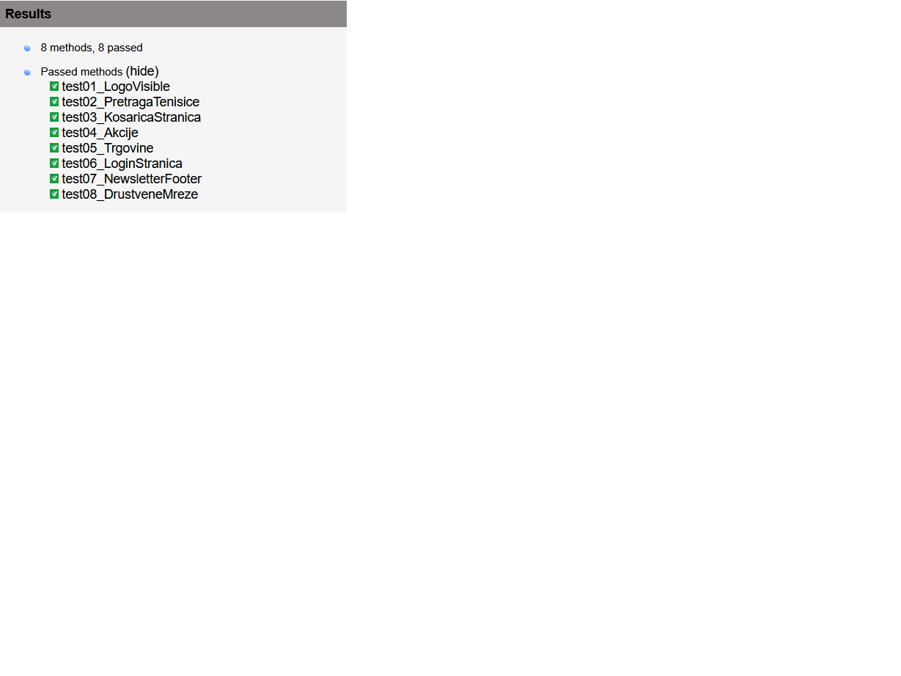

# AUTOMATIZIRANO TESTIRANJE: HERVIS.HR (SELENIUM & TESTNG)

Ovaj projekt predstavlja napredni sustav za automatizirano testiranje web trgovine **Hervis.hr**. Projekt je izrađen prema principima kvalitete koda i modernim praksama automatizacije kako bi se osigurala stabilnost i skalabilnost testova.

---

### Integrirane tehnike i najbolje prakse

U projekt su integrirane sljedeće napredne tehnike koje osiguravaju visoku kvalitetu koda:

* **Page Object Model (POM):** Projekt je strukturiran tako da su lokatori i akcije odvojeni od samih testova (mape `pages` i `tests`), što omogućuje lakše održavanje i bolju čitljivost.
* **OOP (Object-Oriented Programming):** Maksimalno je korišteno **nasljeđivanje (Inheritance)**. `HervisHomePage` nasljeđuje `BasePage`, čime se izbjegava dupliciranje koda i omogućuje ponovna uporaba metoda.
* **Wait naredbe (Explicit Waits):** Umjesto nestabilnih fiksnih pauza (`Thread.sleep`), projekt primarno koristi `WebDriverWait` i `ExpectedConditions` za sinkronizaciju s UI elementima.
* **.gitignore:** Projekt sadrži optimiziranu konfiguraciju koja sprječava slanje nepotrebnih datoteka (`target/`, `.idea/`, `test-output/`) na repozitorij.
* **Reporting:** U `pom.xml` je integriran `maven-surefire-report-plugin` koji omogućuje automatsko generiranje detaljnih HTML izvještaja o prolaznosti testova.

---

### Cross Browser Testing

U okviru `@BeforeMethod` anotacije implementirana je logika koja omogućuje pokretanje testova na različitim preglednicima. Sustav dinamički inicijalizira odgovarajući `WebDriver` ovisno o postavljenoj varijabli:

* **Firefox:** Postavljen kao primarni preglednik za testiranje (GeckoEngine).
* **Chrome:** Potpuna podrška putem `ChromeDriver`-a (Blink engine).
* **Edge:** Potpuna podrška putem `EdgeDriver`-a (Chromium engine).

---

### Tehnologije

* **Java 25** (Programski jezik)
* **Selenium WebDriver 4.27.0** (Automatizacija preglednika)
* **TestNG 7.11.0** (Testing framework)
* **Maven** (Upravljanje ovisnostima i build procesom)

---

### Struktura projekta i POM

Testovi su organizirani kroz Page Object Model kako bi se postigla visoka razina apstrakcije i modularnosti:

* **`src/main/java/pages/BasePage.java`**: Sadrži zajedničke metode (poput `siguranKlik` i `scrollDown`) i inicijalizaciju `WebDriverWait`-a. Ovo je bazna klasa koju ostale stranice nasljeđuju (**OOP princip**).
* **`src/main/java/pages/HervisHomePage.java`**: Sadrži specifične lokatore i metode za interakciju s Hervis web stranicom.
* **`src/test/java/HervisTest.java`**: Sadrži same testne slučajeve, anotacije i validacije (Assert-ove).

---

### Popis i opis testova

1.  **Provjera vidljivosti logotipa (`test01_LogoVisible`)**: Provjerava ispravno učitavanje vizualnog identiteta stranice traženjem logotipa putem CSS selektora.
2.  **Pretraga proizvoda (`test02_PretragaTenisice`)**: Simulira unos pojma "tenisice", pritisak tipke Enter te provjerava sadrži li rezultirajući URL traženi pojam.
3.  **Navigacija u košaricu (`test03_KosaricaStranica`)**: Provjerava pristupačnost košarice klikom na ikonu. Sadrži *fallback* mehanizam koji osigurava pristup putem URL-a ako je element zaklonjen.
4.  **Pristup akcijskim ponudama (`test04_Akcije`)**: Testira navigaciju do Sale/Outlet kategorija pomoću sigurne metode klika (scroll + JS click).
5.  **Lokator trgovina (`test05_Trgovine`)**: Provjerava funkcionalnost stranice za pronalaženje fizičkih poslovnica.
6.  **Dostupnost login stranice (`test06_LoginStranica`)**: Izravno provjerava je li sustav za autentifikaciju korisnika dostupan i ispravno usmjeren.
7.  **Prisutnost Newslettera (`test07_NewsletterFooter`)**: Provjerava postojanje sekcije za pretplatu u podnožju stranice nakon automatskog skrolanja.
8.  **Poveznice na društvene mreže (`test08_DrustveneMreze`)**: Validira postojanje linkova za Facebook i Instagram, potvrđujući ispravnu integraciju marketinških kanala.

---

### Rezultati testiranja

  

---

### Upute za uporabu

#### Preduvjeti
* Instaliran **Java JDK 25** (ili noviji)
* Instaliran **Maven**
* Instaliran preglednik (**Firefox**, **Chrome** ili **Edge**)

#### Pokretanje projekta
1.  **Klonirajte repozitorij:**
    ```bash
    git clone https://github.com/eivelic/mttps-hervis-test.git
    ```
2.  **Pozicionirajte se u mapu projekta:**
    ```bash
    cd mttps-hervis-test
    ```
3.  **Pokrenite testove putem Mavena:**
    ```bash
    mvn test
    ```
4.  **Generirajte izvještaj:**
    ```bash
    mvn surefire-report:report
    ```
    *Izvještaj će se nalaziti na lokaciji: `target/site/surefire-report.html`*
